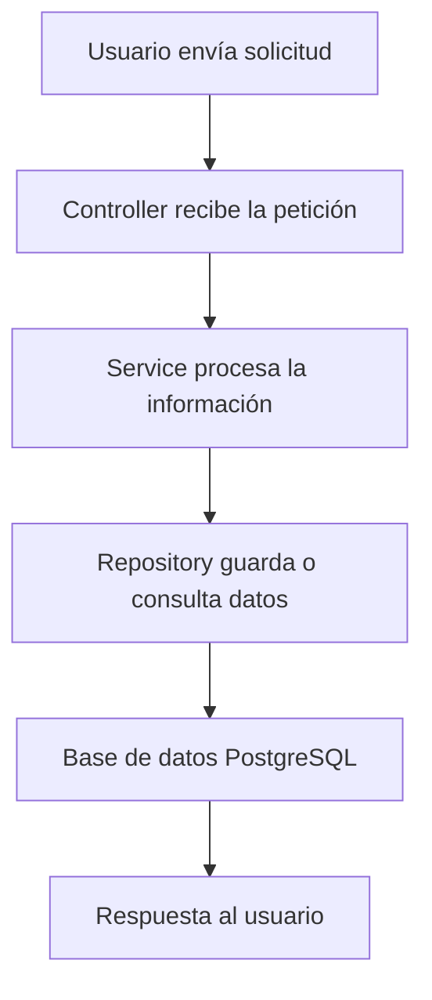
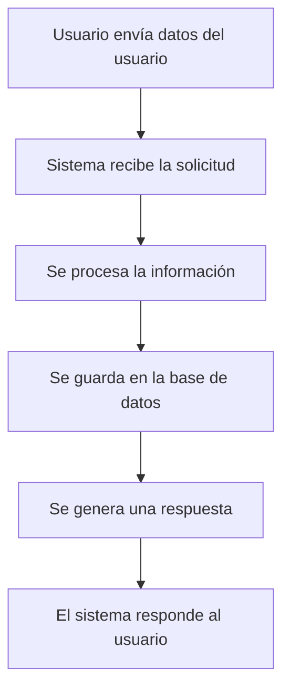

# 🚀 API REST de Gestión de Usuarios

---

## 📌 Descripción

Este proyecto corresponde al desarrollo de una API REST orientada a la gestión de usuarios, implementada con Spring Boot.

Su propósito es comprender los fundamentos del desarrollo backend moderno, aplicando principios de arquitectura por capas, persistencia de datos y comunicación mediante protocolos HTTP.

---

## 🎯 Objetivos de aprendizaje

* Comprender la estructura de una API REST
* Aplicar separación de responsabilidades mediante arquitectura por capas
* Integrar un sistema backend con una base de datos relacional
* Modelar entidades y gestionar persistencia de datos
* Manipular información utilizando formato JSON

---

## 🧱 Arquitectura del sistema

El sistema está organizado en capas, donde cada una cumple una función específica dentro de la aplicación.

### 🔹 ¿Qué hace cada capa?

* **Controller** → Recibe las solicitudes del usuario
* **Service** → Procesa la lógica del sistema
* **Repository** → Gestiona el acceso a la base de datos
* **Base de datos** → Almacena la información

---

## 🔄 ¿Cómo funciona una acción en el sistema?

Cuando un usuario realiza una acción (por ejemplo crear un usuario), el sistema sigue estos pasos:

1. El usuario envía los datos
2. El sistema recibe la solicitud
3. Se procesa la información
4. Se guarda en la base de datos
5. Se entrega una respuesta

---

## 📸 Resultado del sistema

## 🧠 ¿Qué representa este proyecto?

Este sistema simula el funcionamiento básico de una aplicación real de gestión de usuarios.

Permite entender cómo:

* Un usuario envía información
* El backend la procesa
* Se almacena en una base de datos
* Se devuelve una respuesta estructurada

---

## 📦 Tecnologías utilizadas

* Java
* Spring Boot
* Spring Data JPA
* PostgreSQL
* Hibernate

---

## 📊 Estructura del sistema

El proyecto se divide en módulos principales:

* Controller → Entrada de solicitudes
* Service → Lógica del sistema
* Repository → Acceso a datos
* Model → Representación de los usuarios

---

## 📈 Estado del proyecto

✔ API funcional
✔ Arquitectura por capas aplicada
✔ Conexión a base de datos
✔ Operaciones CRUD implementadas

---

## 🧾 Comandos utilizados y su función

| Elemento        | Función                         |
| --------------- | ------------------------------- |
| @RestController | Define el controlador de la API |
| @RequestMapping | Define la ruta principal        |
| @GetMapping     | Obtiene información             |
| @PostMapping    | Crea información                |
| @DeleteMapping  | Elimina información             |
| @Service        | Lógica de negocio               |
| @Repository     | Acceso a base de datos          |
| @Entity         | Define una tabla                |
| JpaRepository   | CRUD automático                 |

---

## 👨‍💻 Autor

Proyecto desarrollado con fines educativos para comprender el desarrollo backend con Java y Spring Boot.
